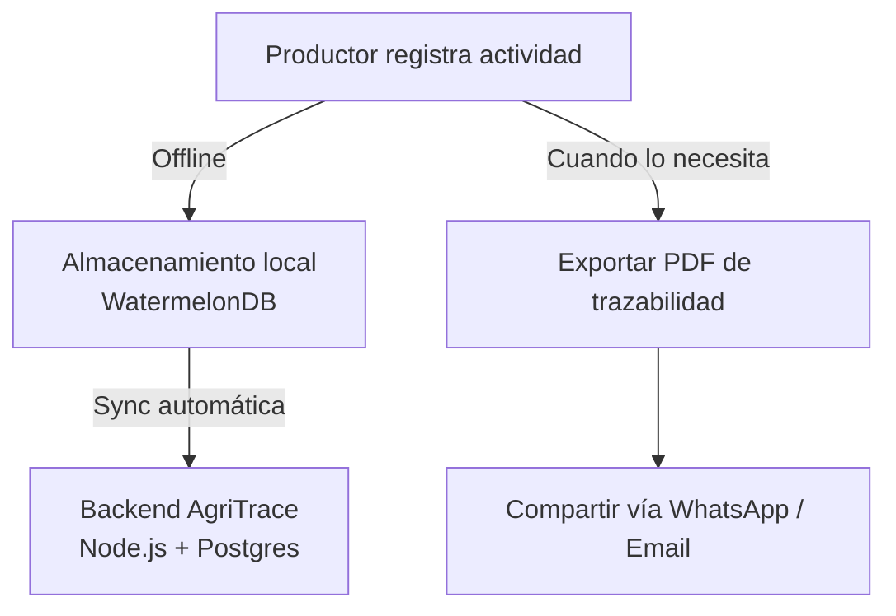
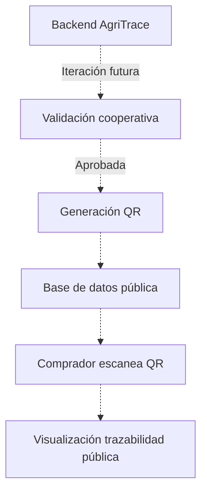

# 🛣️ 3.3 User Journey Maps y Flujos de Usuario

**Versión:** 1.1 (alineada con [`../../09-scope-mvp.md`](../../09-scope-mvp.md) — Mayo 2026)

**Fecha original:** Noviembre 2025
**Última revisión:** Mayo 2026

**Objetivo:** Mapear experiencias de usuario y puntos de dolor para optimizar el diseño UI/UX. Este documento describe el journey del **productor** (único actor del MVP) y conserva los journeys de cooperativa, comprador y administrador como referencia de iteración futura — explícitamente marcados como tal.

---

## 1. Journey Map: Productor (Actor Principal)

### 👤 Persona: Juan Gómez

**Perfil:**

- Edad: 42 años
- Ubicación: Zona Rural, Valle del Cauca
- Cultivo: Café especial (3 hectáreas)
- Experiencia digital: Media-baja
- Dispositivo: Smartphone Android básico
- Conectividad: Intermitente (3G/4G)

---

### 📱 MVP: Descubrimiento y Onboarding

### Contexto

Juan escucha sobre AgriTrace en una capacitación de su cooperativa. Le prometen mejor acceso a mercados internacionales si certifica su trazabilidad.

### Puntos de contacto

1. **Descarga de app** (Play Store/App Store)
2. **Pantalla de bienvenida**
    - Mensaje: "Certifica tus cultivos y accede a mercados premium"
    - 3 slides con beneficios visuales
3. **Registro inicial**
    - Nombre completo
    - Celular (con verificación SMS)
    - Correo (opcional)
    - Contraseña segura

### Puntos de dolor potenciales

- ❌ Formularios muy largos
- ❌ Lenguaje técnico
- ❌ Validación de celular que falla
- ❌ No entiende para qué sirve cada campo

### Soluciones de diseño

- ✅ Registro progresivo (solo 4 campos iniciales)
- ✅ Tooltips contextuales con ejemplos
- ✅ Validación en tiempo real con mensajes amigables
- ✅ Opción de "Saltar" secciones opcionales

---

### 📍 iteración futura: Configuración de Finca

### Contexto

Juan necesita registrar su finca "La Esperanza" con sus 3 lotes de café.

### Pasos del flujo

1. **Dashboard inicial** → Botón "Registrar mi primera finca"
2. **Formulario de finca:**
    - Nombre de la finca
    - Ubicación (autocompletado con GPS)
    - Área total (hectáreas)
    - Foto de la finca (opcional)
3. **Confirmación en mapa:**
    - Visualización de pin en mapa
    - Opción de ajustar manualmente
4. **Creación de lotes:**
    - Modal: "Divide tu finca en lotes"
    - Campos por lote:
        - Nombre (ej: "Lote Norte")
        - Tipo de cultivo (selector con iconos)
        - Área del lote

### Tiempo estimado

⏱️ 5-8 minutos (con conexión estable)

### Puntos de dolor

- ❌ GPS no funciona en zona rural
- ❌ No sabe cómo dividir lotes
- ❌ Pierde progreso si se va la conexión

### Soluciones

- ✅ Entrada manual de coordenadas alternativa
- ✅ Sugerencias: "Puedes crear lotes por edad de siembra o variedad"
- ✅ **Auto-guardado cada 30 segundos**
- ✅ Modo offline con sincronización posterior

---

### 🌱 Etapa 3: Registro de Actividades (Uso Recurrente)

### Contexto

Juan realiza fertilización orgánica en el "Lote Norte" y quiere documentarlo.

### Flujo optimizado

1. **Acceso rápido:**
    - Dashboard → Card "Lote Norte" → Botón "Registrar actividad"
2. **Selector de tipo:**
    - Grid de iconos grandes: 🌱 Siembra | 💧 Riego | 🧪 Fertilización | ✂️ Poda | 📦 Cosecha
3. **Formulario contextual** (campos según tipo):
    - Fecha (pre-llenada con hoy)
    - Tipo de insumo (si aplica)
    - Cantidad/Dosis
    - Notas (opcional)
    - **Foto** (botón grande: "Tomar evidencia")
4. **Confirmación:**
    - Preview de la actividad
    - Botón "Guardar" (verde grande)

### Tiempo estimado

⏱️ 2-3 minutos

### Puntos de dolor

- ❌ Foto muy pesada (señal débil)
- ❌ Olvida registrar actividades a tiempo
- ❌ Tipear en campo es incómodo

### Soluciones

- ✅ Compresión automática de imágenes
- ✅ Notificaciones recordatorias semanales
- ✅ **Entrada por voz** para notas (dictado)
- ✅ Templates pre-llenados para actividades frecuentes

---

### 🏆 Etapa 4: Exportar y Compartir Reporte PDF de Trazabilidad

### Contexto

Juan está listo para cosechar y quiere darle a su comprador, cooperativa o certificador un documento estructurado que muestre todo el historial del lote.

### Flujo (MVP)

1. **Revisión de trazabilidad:**
    - Lote → Botón "Ver historial completo"
    - Timeline con todas las actividades
    - Indicador de completitud: "85% documentado"
2. **Exportar PDF:**
    - Botón prominente: "Exportar PDF de trazabilidad"
    - Modal: "Tu reporte está listo"
    - Preview del PDF
    - Opciones:
        - Descargar
        - Compartir por WhatsApp
        - Email
3. **Compartir:**
    - Mensaje pre-llenado: "Te comparto la trazabilidad de mi lote"

### Puntos de dolor

- ❌ PDF muy pesado si tiene muchas fotos
- ❌ Sin internet al momento de compartir

### Soluciones

- ✅ Compresión de fotos en el PDF
- ✅ PDF generado localmente (offline-capable)
- ✅ Tutorial integrado: "Cómo compartir tu trazabilidad"

> **Generación de QR público y página de trazabilidad escaneable** quedan diferidas a iteración futura (scope-mvp.md §4). Razón: encuesta de stakeholders mostró cero demanda firme de QR público; el reporte PDF cubre la necesidad operativa del MVP de manera más simple y verificable.

---

## 2. Journey Map: Cooperativa (Validador) — ⏸️ Diferido

> **Nota:** Este flujo es iteración futura. El MVP se enfoca solo en el productor (Section 1).

### 👤 Persona: María López

**Perfil:**

- Rol: Coordinadora de Certificaciones
- Edad: 35 años
- Ubicación: Oficina urbana
- Dispositivo: Laptop + Tablet
- Experiencia: Alta en gestión agrícola, media en tecnología

---

### 📊 MVP: Onboarding Cooperativa

### Contexto

La cooperativa adopta AgriTrace para certificar a sus 120 productores asociados.

### Flujo

1. **Registro institucional:**
    - Datos de la cooperativa
    - NIT/RUT
    - Certificaciones que valida (selección múltiple)
2. **Invitación de productores:**
    - Carga masiva de contactos (CSV)
    - Envío automático de invitaciones por SMS/Email
3. **Dashboard de gestión:**
    - Lista de productores asociados
    - Estados: Pendiente | En proceso | Certificado

### Tiempo estimado

⏱️ 30 minutos (configuración inicial)

---

### ✅ iteración futura: Validación de Certificaciones

### Contexto

María debe revisar y aprobar las certificaciones de productores.

### Flujo

1. **Cola de revisión:**
    - Notificación: "5 solicitudes pendientes"
    - Tarjetas ordenadas por prioridad
2. **Revisión detallada:**
    - Datos del productor
    - Documentos adjuntos (PDF)
    - Historial de actividades del lote
    - Checklist de requisitos
3. **Decisión:**
    - ✅ Aprobar (con firma digital)
    - ❌ Rechazar (con comentarios)
    - ⏸️ Solicitar correcciones

### Puntos de dolor

- ❌ Muchos productores para revisar
- ❌ Documentos en formatos variados
- ❌ Falta información clave

### Soluciones

- ✅ Sistema de priorización automática
- ✅ Visor unificado de documentos
- ✅ Checklist automatizado (validación de campos)
- ✅ Comentarios predefinidos para agilizar rechazos

---

### 📈 Etapa 3: Monitoreo Continuo

### Contexto

María necesita generar reportes para auditorías externas.

### Flujo

1. **Dashboard analítico:**
    - Métricas clave:
        - Productores certificados
        - Hectáreas trazadas
        - Actividades registradas (últimos 30 días)
2. **Generación de reportes:**
    - Filtros: Rango de fechas, tipo de certificación, región
    - Formatos: PDF, Excel
3. **Alertas automáticas:**
    - Certificaciones próximas a vencer
    - Productores sin actividad reciente

### Soluciones

- ✅ Exportación de datos en formatos estándar
- ✅ Gráficos interactivos
- ✅ Sistema de alertas configurable

---

## 3. Journey Map: Comprador/Exportador — ⏸️ Diferido

> **Nota:** Este flujo es iteración futura. El MVP no incluye funcionalidad de comprador/marketplace.

### 👤 Persona: Thomas Müller

**Perfil:**

- Rol: Comprador de café especial (Alemania)
- Edad: 48 años
- Prioridad: Transparencia y sostenibilidad
- Dispositivo: Smartphone + Desktop

---

### 🔍 MVP: Consulta de Trazabilidad (Experiencia Pública)

### Contexto

Thomas recibe un QR de un productor colombiano y quiere verificar la calidad del café.

### Flujo

1. **Escaneo del QR:**
    - Cámara del celular o app
    - Redirección instantánea a página pública
2. **Landing page de trazabilidad:**
    - Hero: Foto del lote + Nombre del productor
    - Badge destacado: "✅ Certificado por [Cooperativa]"
    - Secciones:
        - Información del lote
        - Timeline de actividades (con fotos)
        - Certificaciones (descargables)
        - Ubicación en mapa
        - Datos de contacto del productor
3. **Verificación de autenticidad:**
    - Sello digital con timestamp
    - Enlace a blockchain (futuro)

### Tiempo estimado

⏱️ 2-3 minutos

### Puntos de dolor

- ❌ QR no abre o da error 404
- ❌ Información incompleta
- ❌ No puede descargar certificados

### Soluciones

- ✅ URLs permanentes (no expiran)
- ✅ Validación previa antes de generar QR
- ✅ Descarga directa de PDFs
- ✅ Traducción automática (inglés/alemán)

---

### 📧 iteración futura: Contacto con Productor

### Flujo

1. **Botón de contacto:**
    - "Contactar productor" → Formulario
2. **Mensaje pre-llenado:**
    - "Hola [Nombre], me interesa tu café del lote [X]"
3. **Notificación al productor:**
    - WhatsApp/Email con datos del comprador

### Soluciones

- ✅ Protección de datos (email no público)
- ✅ Sistema anti-spam
- ✅ Traducción automática de mensajes

---

## 4. Journey Map: Administrador del Sistema — ⏸️ Diferido

> **Nota:** Este flujo es iteración futura. El MVP usa autenticación básica; admin panel se agrega después.

### 👤 Persona: Carlos Ramírez

**Perfil:**

- Rol: Admin AgriTrace
- Responsabilidad: Seguridad y operación
- Herramientas: Panel web avanzado

---

### 🛡️ MVP: Gestión de Usuarios

### Flujo

1. **Panel de administración:**
    - Lista de usuarios con filtros
    - Estados: Activo | Suspendido | Pendiente verificación
2. **Acciones:**
    - Verificar identidad manual
    - Activar/Desactivar cuentas
    - Resetear contraseñas
    - Ver logs de actividad

---

### 📊 iteración futura: Auditoría y Seguridad

### Flujo

1. **Dashboard de logs:**
    - Eventos críticos
    - Intentos de acceso fallidos
    - Cambios en certificaciones
2. **Reportes de auditoría:**
    - Exportación de logs
    - Alertas de anomalías

### Soluciones

- ✅ Sistema de alertas en tiempo real
- ✅ Integración con herramientas de monitoreo
- ✅ Backup automático diario

---

## 5. Flujo de Datos: Diagrama de Integración

### MVP (implementado)

### Iteración futura (no MVP)

---

## 6. Métricas de Éxito por Fase (KPIs)

### Onboarding

- ✅ 80%+ usuarios completan registro en < 5 min
- ✅ 90%+ activan funcionalidad offline

### Uso recurrente

- ✅ Promedio 3+ actividades registradas por semana
- ✅ 70%+ suben foto en cada registro

### Validación

- ✅ Tiempo promedio de revisión < 10 min
- ✅ 95%+ certificaciones aprobadas en primera instancia

### Consulta pública

- ✅ Tiempo de carga QR < 2 segundos
- ✅ 85%+ visitantes ven timeline completo

---

## 7. 🎯 Priorización de Pantallas MVP

> **Fuente única de verdad:** La priorización detallada de pantallas, MoSCoW, hitos por semana y KPIs se encuentra en:
>
> 📄 **[`01-priorizacion-features-mvp.md`](../01-priorizacion-features-mvp.md)**
>
> Este documento (User Journeys) describe los flujos de usuario y puntos de dolor por fase.
> La decisión de qué construir, cuándo y en qué orden está centralizada en el archivo de priorización.

---

**Fin del documento — User Journeys AgriTrace v1.1**

© 2025-2026 Diego Trujillo