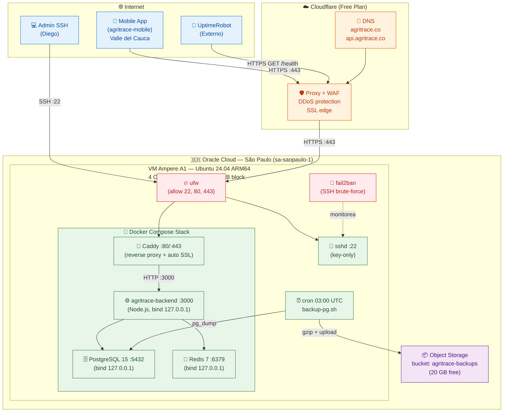
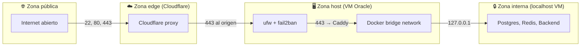
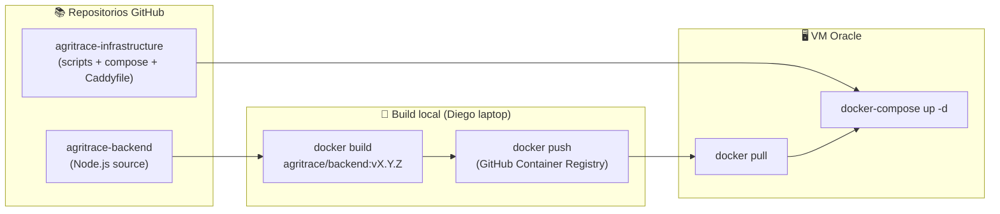

# 02 - Topología de Infraestructura

**Fecha**: Mayo 2026
**Versión**: 1.0
**Estado**: Aprobado para implementación
**Responsable**: Diego Trujillo
**Documento padre**: [01-decisiones-infra.md](01-decisiones-infra.md)

---

## 1. Resumen

Este documento describe la topología física y lógica del despliegue MVP, los flujos de tráfico, los puertos expuestos, y las fronteras de red. Toda la implementación corre en una sola VM Oracle Cloud (São Paulo) con servicios orquestados vía Docker Compose, expuesta a internet únicamente a través de Cloudflare.

---

## 2. Diagrama de Topología



---

## 3. Componentes

### 3.1 Frontera de Internet

| Componente | Tipo | Función |
|-----------|------|---------|
| Mobile App | Cliente | `agritrace-mobile` (Flutter) instalada en celulares de agricultores; consume API HTTPS |
| Admin SSH | Cliente | Acceso administrativo del desarrollador vía SSH con clave |
| UptimeRobot | Servicio externo | Monitor que verifica `https://api.agritrace.co/health` cada 5 minutos |

### 3.2 Cloudflare (Edge)

| Componente | Función |
|-----------|---------|
| DNS | Resuelve `agritrace.co` y `api.agritrace.co` a la IP pública de la VM Oracle |
| Proxy (modo "proxied") | Oculta la IP real de la VM; todo el tráfico HTTPS atraviesa la red Cloudflare |
| WAF básico | Bloqueo automático de bots conocidos y patrones SQLi básicos |
| SSL edge | Certificado en el borde Cloudflare (independiente del certificado Let's Encrypt que emite Caddy) |
| DDoS protection | Mitigación automática volumétrica (incluida en plan free) |

### 3.3 Oracle Cloud (Origen)

| Componente | Tipo | Detalle |
|-----------|------|---------|
| VM Ampere A1 | Compute | Ubuntu 24.04 LTS ARM64, 4 OCPU, 24 GB RAM, 200 GB block storage |
| IP pública | Red | Reservada (no efímera) para evitar cambios al reiniciar |
| Object Storage bucket | Almacenamiento | `agritrace-backups`, 20 GB free, retención 7 días vía lifecycle policy |

### 3.4 Servicios dentro de la VM

| Servicio | Imagen | Puerto interno | Bind | Expuesto a internet |
|----------|--------|----------------|------|---------------------|
| **Caddy** | `caddy:2-alpine` | 80, 443 | `0.0.0.0` | ✅ Sí (80 redirige a 443) |
| **agritrace-backend** | `agritrace/backend:latest` | 3000 | `127.0.0.1:3000` | ❌ No (solo localhost) |
| **PostgreSQL** | `postgres:15-alpine` | 5432 | `127.0.0.1:5432` | ❌ No (solo localhost) |
| **Redis** | `redis:7-alpine` | 6379 | `127.0.0.1:6379` | ❌ No (solo localhost) |

### 3.5 Capa de seguridad del host

| Componente | Función |
|-----------|---------|
| `ufw` | Firewall del kernel: deniega por defecto, permite solo 22, 80, 443 |
| `fail2ban` | Banea IPs con > 5 intentos SSH fallidos en 10 min (jail `sshd`) |
| `sshd` | Configurado con `PermitRootLogin no`, `PasswordAuthentication no`, solo claves |

---

## 4. Flujo de una Petición HTTPS

Caso típico: agricultor sincroniza actividades pendientes.

```
1. Mobile app → DNS lookup `api.agritrace.co`
   └─ Cloudflare DNS responde con IP de Cloudflare (no de Oracle)

2. Mobile app → HTTPS POST /api/v1/sync (a IP Cloudflare)
   └─ TLS handshake con certificado edge de Cloudflare

3. Cloudflare proxy → WAF inspecciona request
   ├─ Patrón malicioso? → bloquea (response 403)
   └─ Limpio → reescribe headers, agrega CF-Connecting-IP, reenvía

4. Cloudflare → HTTPS al origen (IP pública del VM Oracle, puerto 443)
   └─ TLS handshake con certificado Let's Encrypt emitido por Caddy

5. VM Oracle :443 → ufw permite (regla 443/tcp)

6. Caddy :443 → termina TLS, lee Host header `api.agritrace.co`
   └─ Coincide con bloque del Caddyfile

7. Caddy → HTTP proxy a `127.0.0.1:3000`

8. agritrace-backend :3000 → procesa request
   ├─ Lee/escribe en PostgreSQL :5432 (127.0.0.1)
   ├─ Lee/escribe en Redis :6379 (cache, rate limit)
   └─ Retorna response JSON

9. Response viaja en reversa: API → Caddy → Cloudflare → Mobile app
```

**Latencia esperada** (Cali → Cloudflare PoP Bogotá → Oracle São Paulo): ~80-150ms ida y vuelta.

---

## 5. Flujo de Sincronización Mobile (Offline-First)

```
[Agricultor sin conexión]
   └─ Mobile app guarda actividad en WatermelonDB local
       └─ Marca registro como `pending_sync = true`

[Agricultor entra zona con señal — días después]
   └─ Mobile app detecta conectividad
       └─ Push batch de registros pendientes vía POST /api/v1/sync
           ├─ Cloudflare → Caddy → Backend
           ├─ Backend valida, persiste en PostgreSQL
           └─ Responde con server IDs + timestamps autoritativos
       └─ Mobile app actualiza local, marca `pending_sync = false`
```

**Idempotencia**: cada actividad lleva UUID generado en cliente. Retry seguro.

---

## 6. Flujo de Backup Diario

```
[03:00 UTC = 22:00 Cali]

cron en VM dispara /opt/agritrace/scripts/backup-pg.sh
   │
   ├─ pg_dump -Fc agritrace_mvp → archivo binario comprimido
   ├─ gzip → archivo .sql.gz con timestamp
   ├─ oci os object put → sube al bucket agritrace-backups
   ├─ Verifica checksum SHA-256 post-upload
   ├─ Elimina backups locales > 3 días
   └─ Loguea resultado en /var/log/agritrace/backup.log
```

**Lifecycle policy bucket**: archivos > 7 días se borran automáticamente.

**Detalle completo** en [`03-secretos-y-backups.md`](03-secretos-y-backups.md).

---

## 7. Tabla de Puertos y Bindings

| Servicio | Puerto | Protocolo | Bind interface | Accesible desde |
|----------|--------|-----------|----------------|-----------------|
| sshd | 22 | TCP | `0.0.0.0` | Internet (filtrado por fail2ban) |
| Caddy HTTP | 80 | TCP | `0.0.0.0` | Internet (redirige a 443) |
| Caddy HTTPS | 443 | TCP | `0.0.0.0` | Internet (vía Cloudflare) |
| agritrace-backend | 3000 | TCP | `127.0.0.1` | Solo procesos en VM |
| PostgreSQL | 5432 | TCP | `127.0.0.1` | Solo procesos en VM |
| Redis | 6379 | TCP | `127.0.0.1` | Solo procesos en VM |

**Regla clave**: ningún servicio de datos (Postgres, Redis) ni el backend están expuestos directamente a internet. Caddy es la única puerta.

---

## 8. Fronteras de Red



**Reglas**:

- **Pública → Edge**: solo a través de Cloudflare (DNS apunta allí)
- **Edge → Host**: solo HTTPS al puerto 443; ufw filtra
- **Host → Internal**: Caddy es el único proceso autorizado a conectar a `127.0.0.1:3000`
- **Internal**: servicios se comunican vía Docker bridge network o `127.0.0.1`

---

## 9. Diagrama de Despliegue (Vista de Componentes)



**Nota MVP**: build local en laptop Diego, push a `ghcr.io` (free para repos públicos/privados), pull desde VM. CI/CD vía GitHub Actions queda diferido (ver [01-decisiones-infra.md §4](01-decisiones-infra.md)).

---

## 10. Latencia y Capacidad Esperada

| Métrica | Valor estimado |
|---------|----------------|
| Latencia Cali → Cloudflare PoP Bogotá | ~10-30 ms |
| Latencia Cloudflare Bogotá → Oracle São Paulo | ~50-100 ms |
| Latencia total ida y vuelta (sync) | ~80-150 ms |
| Throughput VM (red Oracle SP free) | 480 Mbps egress, sin límite mensual de tráfico interno |
| CPU sostenido | 4 OCPU ARM Ampere = ~equivalente a 2 cores x86 modernos |
| Memoria efectiva | 24 GB (10 GB Postgres + 2 GB Redis + 4 GB API + 8 GB headroom) |
| IOPS block storage | ~1000 IOPS sustained (suficiente para Postgres MVP) |

**Capacidad estimada**: la VM aguanta sin problema **500-2.000 usuarios activos** con el patrón offline-first (sync intermitente, no concurrente).

---

## 11. Single Points of Failure

| SPOF | Impacto | Mitigación MVP | Solución futura |
|------|---------|----------------|-----------------|
| VM Oracle única | Caída completa del servicio | Aceptado en piloto; RTO 2h vía re-deploy | Múltiples VMs + load balancer |
| Postgres en mismo host que API | Si DB cae, todo cae | Aceptado; backup diario | Postgres managed (Neon/Supabase) |
| Cloudflare como proxy obligatorio | Si Cloudflare baja, app baja | Cloudflare tiene SLA ~99.99%; sin acción | Multi-CDN o DNS directo |
| Oracle suspende cuenta free | Pérdida total infra | Backup externo + IaC reproducible | Migración a Hetzner / Fly.io |
| Conectividad interlatam (Brasil → Colombia) | Latencia elevada en eventos red | Aceptado (no afecta offline-first) | Migrar a Bogotá (Fly.io) |

---

## 12. Referencias

- Decisiones de proveedor y stack: [`01-decisiones-infra.md`](01-decisiones-infra.md)
- Detalle de secretos y backups: [`03-secretos-y-backups.md`](03-secretos-y-backups.md)
- Modelado de costos y escalado: [`04-costos-y-escalado.md`](04-costos-y-escalado.md)
- Arquitectura de aplicación: [`../05-arquitectura-tecnica/01-resumen-arquitectura.md`](../05-arquitectura-tecnica/01-resumen-arquitectura.md)
- Repo de implementación: [`agritrace-infrastructure`](https://github.com/diegotrujillor/agritrace-infrastructure)
