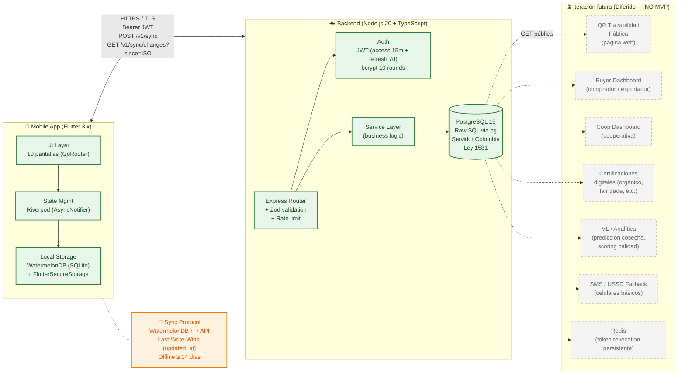

# Documentación Técnica

Especificaciones técnicas detalladas, guías de implementación y documentos de arquitectura para la plataforma AgriTrace.

## Arquitectura del Sistema — MVP

> 📍 **Estado**: MVP (versión inicial). Este diagrama evolucionará a medida que se incorporen los componentes de iteración futura (QR público, dashboards de buyer/coop, SMS/USSD, Redis para revocación de tokens, etc.).

### Flujo principal (MVP)

1. **Productor abre app móvil** → autenticación local con JWT en `flutter_secure_storage`.
2. **Crea finca → lote → actividad** → datos persisten en WatermelonDB local con flag `_status: 'created'`.
3. **App detecta conectividad** (`connectivity_plus`) → dispara sync.
4. **Mobile envía** `POST /v1/sync` con changes pendientes; servidor responde `synced` y conflictos.
5. **Mobile pide cambios remotos** `GET /v1/sync/changes?since=<ISO>` → reconcilia local con `_status: 'synced'`.
6. **Backend persiste** en PostgreSQL con `updated_at` y `synced_at`. Conflictos por Last-Write-Wins.

### Decisiones técnicas clave

| Decisión | Razón |
|----------|-------|
| **Offline-first con WatermelonDB** | 14+ días sin conexión validados como requisito (zona rural Valle) |
| **Raw SQL (sin ORM) en backend** | Simplicidad, control total, sin abstracciones para MVP |
| **JWT en memoria + revocation in-memory** | MVP no requiere alta disponibilidad de revocación; Redis es iteración futura |
| **PostgreSQL en servidor Colombia** | Ley 1581 obliga residencia de datos personales en territorio nacional |
| **Express + Zod + Winston** | Stack mínimo, bien documentado, fácil de mantener por founder solo |
| **Spanish only en UI** | MVP valida con productores Valle; i18n es iteración futura |

### Componentes diferidos (iteración futura)

Los componentes punteados en el diagrama están explícitamente fuera del alcance del MVP. Su activación depende de:
- **QR + Buyer Dashboard**: validación de demanda con 5+ compradores reales (cero respondientes en encuesta inicial).
- **Coop Dashboard**: partnership formal con al menos 1 cooperativa activa.
- **SMS / USSD**: ≥ 30% de pilotos confirmados sin smartphone.
- **Redis**: > 100 usuarios concurrentes con necesidad de revocación instantánea.
- **Certificaciones**: convenio con cuerpo certificador (Rainforest, Fair Trade, etc.).
- **ML**: ≥ 6 meses de datos históricos en producción.

## Organización

### [01-analisis](01-analisis/)
Análisis completo del sistema y desglose de requerimientos, incluyendo análisis de características y análisis técnico completo.

### [02-base-de-datos](02-base-de-datos/)
Especificaciones de diseño de base de datos, diagramas de entidad-relación y modelos de datos para la plataforma.

### [03-api](03-api/)
Especificaciones de API y directrices de diseño, incluyendo documentación OpenAPI/Swagger.

### [04-desarrollo](04-desarrollo/)
Directrices de desarrollo, estándares de código y mejores prácticas para el proyecto.

### [05-documentacion](05-documentacion/)
Estándares de documentación y directrices para código, APIs y contenido orientado al usuario.

### [06-deployment](06-deployment/)
Procedimientos de despliegue, gestión de versiones y directrices operativas.

## Guía de Estructura del Repositorio

### [00-referencia/01-guia-estructura-repositorio.md](../00-referencia/01-guia-estructura-repositorio.md)
Documentación completa de la estructura de repositorio recomendada, convenciones de nombres y principios de organización.

## Documentación Relacionada

- Ver [../01-preparacion-mvp/](../01-preparacion-mvp/) para especificaciones y planificación del MVP
- Ver [../03-recursos/](../03-recursos/) para diagramas, imágenes y otros recursos
