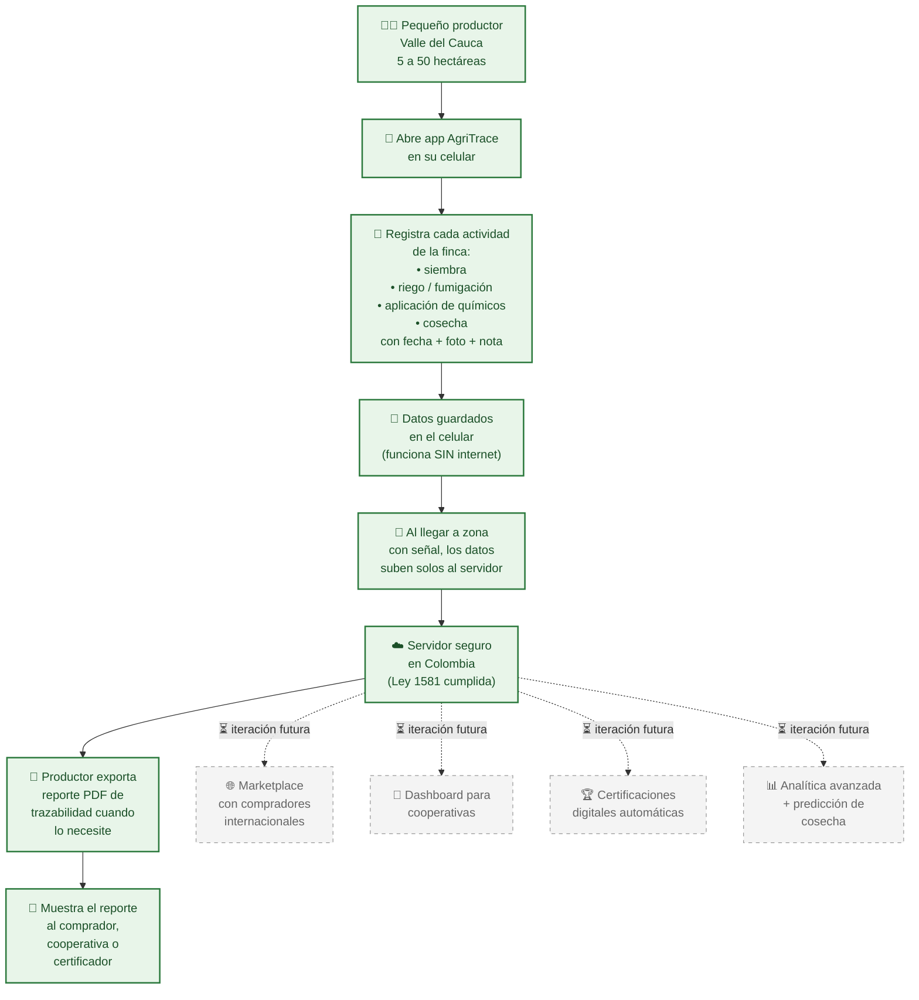

# Repositorio de Documentación AgriTrace

Documentación completa de AgriTrace - una plataforma digital para trazabilidad agrícola, certificación de sostenibilidad y conexiones comerciales internacionales.

**Descripción del Proyecto**: AgriTrace permite a productores agrícolas (cacao, café, frutas exóticas) digitalizar la trazabilidad completa del cultivo desde la siembra hasta la exportación, certificar procesos sostenibles y conectar directamente con compradores internacionales.

## Visión General — MVP

> 📍 **Estado**: MVP (versión inicial). Este diagrama evolucionará en fases futuras (marketplace, certificaciones digitales, dashboards de cooperativa y comprador).

**¿Qué resuelve?** Hoy los pequeños productores registran lo que hacen en cuadernos, almanaques o de memoria. Cuando un comprador o certificador les pide pruebas, no las tienen organizadas. AgriTrace convierte el celular en su cuaderno digital — funciona sin internet, sincroniza solo cuando hay señal, y genera reportes listos para mostrar.

**¿Qué NO incluye el MVP?** Marketplace de compradores, dashboard de cooperativas, certificaciones digitales y analítica avanzada están planeadas para iteración futura (líneas punteadas en el diagrama). MVP valida primero que el productor adopte la app.

## Estructura del Repositorio

Este repositorio está organizado por fase del proyecto y tema para facilitar la navegación y lectura secuencial. Las carpetas numeradas indican el orden de exploración.

### [01-preparacion-mvp](01-preparacion-mvp/)

Especificaciones completas y planificación del Producto Mínimo Viable (MVP), incluyendo:
- Encuesta de partes interesadas y requerimientos
- Requerimientos funcionales y no funcionales
- Especificaciones de diseño UI/UX
- Arquitectura técnica
- Planes de configuración de infraestructura
- Cronograma del proyecto y línea de tiempo
- Seguimiento de presupuesto e inversión

**Duración**: 6 semanas | **Presupuesto**: ≈ $2.7M – $4.8M COP

**Lee Primero**: Comienza con [01-preparacion-mvp/README.md](01-preparacion-mvp/README.md)

### [02-documentacion-tecnica](02-documentacion-tecnica/)

Especificaciones técnicas detalladas para desarrolladores y arquitectos:
- Análisis y diseño del sistema
- Especificaciones de base de datos
- Documentación de API
- Directrices de desarrollo
- Procedimientos de despliegue
- Guía de estructura del repositorio

### [03-recursos](03-recursos/)

Recursos compartidos incluyendo diagramas, imágenes, iconos y directrices de marca.

## Inicio Rápido

**⚡ MVP Strategy: App móvil solo para agricultores (farmer-first, offline-first). Marketplace con compradores es iteración futura.**

1. **Para Partes Interesadas del Negocio**: Comienza con [Alcance MVP](01-preparacion-mvp/09-scope-mvp.md) → [Descripción General MVP](01-preparacion-mvp/README.md) → [Requerimientos Funcionales](01-preparacion-mvp/02-requerimientos-funcionales/)

2. **Para Diseñadores**: Comienza con [Priorización Features](01-preparacion-mvp/04-diseno-ui-ux/01-priorizacion-features-mvp.md) → [Diseño UI/UX](01-preparacion-mvp/04-diseno-ui-ux/) → [Especificaciones de Pantallas](01-preparacion-mvp/04-diseno-ui-ux/02-especificaciones-pantallas/)

3. **Para Desarrolladores**: Comienza con [Alcance MVP](01-preparacion-mvp/09-scope-mvp.md) → [Documentación Técnica](02-documentacion-tecnica/README.md) → [Arquitectura Técnica](01-preparacion-mvp/05-arquitectura-tecnica/) → [Decisión Offline Storage](01-preparacion-mvp/04-diseno-ui-ux/offline-storage-decision.md) → [Configuración Docker](02-documentacion-tecnica/docker-compose-dev.md)

4. **Para Gestores de Proyectos**: Comienza con [Alcance MVP](01-preparacion-mvp/09-scope-mvp.md) → [Cronograma](01-preparacion-mvp/README.md)

5. **Para Founders no-vendedores (capa comercial)**: Comienza con [Comercial / GTM README](01-preparacion-mvp/10-comercial-gtm/README.md) → [ICP y segmentación](01-preparacion-mvp/10-comercial-gtm/01-icp-y-segmentacion.md) → [Pitch 30s/2min](01-preparacion-mvp/10-comercial-gtm/03-pitch-30s-y-2min.md) → [Cronograma 4 semanas](01-preparacion-mvp/10-comercial-gtm/09-cronograma-validacion-4-semanas.md)

## Hoja de Ruta MVP

| Fase | Cronograma | Enfoque |
|------|-----------|---------|
| 1 | Semana 1 | Análisis funcional y definición del alcance |
| 2-3 | Semanas 2-3 | Diseño UI/UX y marca |
| 3 | Semana 3 | Arquitectura técnica y diseño de base de datos |
| 4 | Semana 4 | Provisión de infraestructura |
| 5-6 | Semanas 5-6 | Gestión de proyectos y hoja de ruta |

## Entregables Clave

La MVP producirá:

✅ Documentación de requerimientos funcionales y no funcionales  
✅ Diseño UI/UX completo en Figma con prototipo interactivo  
✅ Diagramas de arquitectura técnica y diseño de base de datos  
✅ Infraestructura operativa en OpenStack/VPS  
✅ Hoja de ruta de desarrollo de 6 meses con backlog y KPIs  
✅ Identidad de marca y sistema de diseño  
✅ Documentación completa para el inicio de iteración futura

## Organización de Archivos

Todos los archivos están organizados siguiendo estas convenciones:

- **Nombres de carpetas**: Español, minúsculas con guiones, numeradas para orden de exploración secuencial (ej. `01-preparacion-mvp`, `02-documentacion-tecnica`)
- **Nombres de archivos**: Español, minúsculas con guiones y prefijos numéricos (ej. `01-requerimientos-funcionales.md`)
- **Sin emojis en nombres de archivos**: Los emojis se utilizan solo en encabezados para organización visual
- **Numeración secuencial**: Indica el orden de lectura recomendado dentro de cada sección

Ver [02-documentacion-tecnica/00-guia-estructura-repositorio.md](02-documentacion-tecnica/00-guia-estructura-repositorio.md) para información detallada de la estructura.

## Consejos de Navegación

- Cada sección importante tiene un archivo **LEEME.md** que explica el contenido y proporciona orden de lectura
- Los archivos están **numerados secuencialmente** para indicar orden de lectura recomendado
- **Las subsecciones están organizadas jerárquicamente** por tema
- **Las referencias cruzadas** vinculan entre documentos relacionados

## Contribuyendo

Al agregar nueva documentación:

1. Coloca el contenido en la fase o sección técnica apropiada
2. Utiliza nombres en español en minúsculas con guiones y prefijos numéricos
3. Crea o actualiza archivos LEEME.md para nuevas secciones
4. Actualiza este README principal si agregas secciones importantes
5. Sigue la estructura definida en [02-documentacion-tecnica/00-guia-estructura-repositorio.md](02-documentacion-tecnica/00-guia-estructura-repositorio.md)

## Repositorios Relacionados

- **agritrace-backend**: Implementación del API de Backend (Node.js)
- **agritrace-frontend**: Aplicación Frontend (React Native)
- **agritrace-infrastructure**: Infraestructura como Código (OpenStack/Docker)

## Preguntas o Actualizaciones

- Revisa [02-documentacion-tecnica/00-guia-estructura-repositorio.md](02-documentacion-tecnica/00-guia-estructura-repositorio.md) para preguntas sobre organización
- Consulta el archivo LEEME.md en cada sección principal para orientación específica del tema
- Ver documentos individuales para especificaciones detalladas

---

**Última Actualización**: Mayo 2026  
**Estado**: Preparación MVP (En Progreso)
